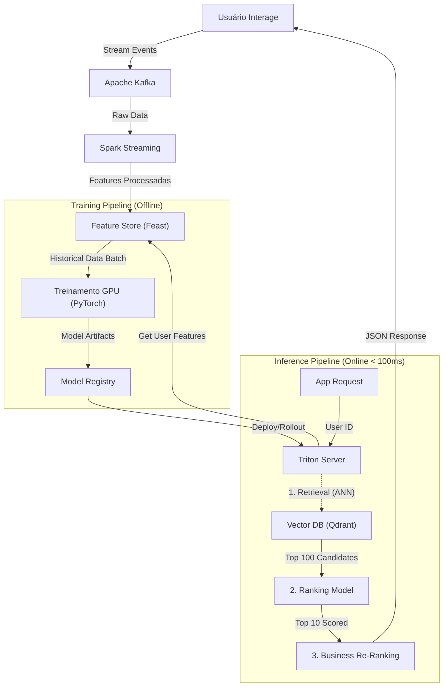

```mermaid
graph TD
    %% Coleta de Dados
    User[Usuário Interage] -->|Stream Events| Kafka[Apache Kafka]
    Kafka -->|Raw Data| Spark[Spark Streaming]
    Spark -->|Features Processadas| FS["Feature Store (Feast)"]
    
    %% Pipeline de Treino Offline
    subgraph "Training Pipeline (Offline)"
        FS -->|Historical Data Batch| Train["Treinamento GPU (PyTorch)"]
        Train -->|Model Artifacts| MLflow[Model Registry]
    end
    
    %% Pipeline de Inferência Online
    subgraph "Inference Pipeline (Online < 100ms)"
        Req[App Request] -->|User ID| Serving[Triton Server]
        Serving -->|Get User Features| FS
        Serving -.->|"1. Retrieval (ANN)"| VecDB["Vector DB (Qdrant)"]
        VecDB -->|Top 100 Candidates| Rank[2. Ranking Model]
        Rank -->|Top 10 Scored| ReRank[3. Business Re-Ranking]
    end
    
    %% Conexões Finais
    ReRank -->|JSON Response| User
    MLflow -->|Deploy/Rollout| Serving
```